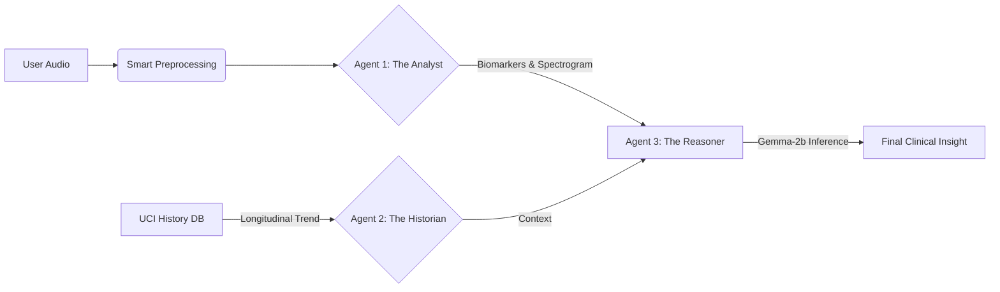

# 🧠 MedGemma-PD: Clinical Decision Support System
### Explainable AI for Parkinson's Disease Monitoring using Multi-Agent Reasoning

[](https://huggingface.co/google/gemma-2b-it)
[](LICENSE)
[](https://streamlit.io)
[]()

> *MedGemma Impact Challenge 2026*

---

## 📋 Overview
**MedGemma-PD** is a **"Glass Box" Clinical Decision Support System** designed to bridge the gap between "Black Box" AI and clinical trust.

Unlike standard classifiers that output a raw probability (e.g., *"87% Risk"*), MedGemma deploys a **Multi-Agent System** to analyze patient speech, retrieve longitudinal history, and synthesize a natural language **Clinical Note** explaining *why* a patient is at risk.

It explicitly targets the "Data Fragmentation" problem in medical research by utilizing **Composite Synthetic Profiles** to simulate complex, multi-modal patient trajectories.

---

## 🏗️ System Architecture: The Agentic Workflow

MedGemma operates via three specialized autonomous agents working in tandem:



*   **Agent 1 (The Analyst):** A Signal Processing engine that extracts vocal biomarkers (Jitter, Shimmer, HNR) and generates Mel-Spectrograms for visual evidence.
*   **Agent 2 (The Historian):** A Context engine that retrieves 6-month longitudinal patient history (UPDRS scores) to determine disease progression (Stable vs. Deteriorating).
*   **Agent 3 (The Reasoner):** A Large Language Model (Gemma-2b) that acts as the "Senior Resident," synthesizing the conflicting data from Agents 1 & 2 into a coherent medical assessment.

---

## 🤖 Why Gemma? (The HAI-DEF Model)
We explicitly selected **Google's Gemma-2b-it** (via Hugging Face) as the core reasoning engine for three critical reasons:

1.  **Edge AI & Privacy (HIPAA Compliance):** Unlike GPT-4 or Gemini Pro, Gemma-2b is lightweight enough to run locally on-device. This ensures that **sensitive patient voice data never leaves the secure hospital server**, satisfying strict medical privacy regulations.
2.  **In-Context Learning:** Gemma demonstrates superior ability to handle our "Composite Profiles" prompt structure, synthesizing numerical biomarkers into human-readable text without expensive fine-tuning.
3.  **Open Weight Transparency:** Using an open-weight model allows for full auditability of the decision-making process, crucial for "Explainable AI" in healthcare.

---

## 🔬 Key Innovations & Methodology

### 1. Composite Synthetic Profiles (Solving the Data Gap)
No public dataset exists that links raw audio with 6-month longitudinal history for the same patient. To validate our reasoning engine, we engineered **Composite Synthetic Profiles**.

*   **Method:** We logically mapped high-fidelity audio samples from the MDVR-KCL Dataset to clinical trajectories from the UCI Telemonitoring Dataset.
*   **Result:** This allowed us to stress-test the system with realistic, conflicting scenarios (e.g., Audio indicates high tremor, but History indicates stability) to verify logical robustness.

### 2. Autonomous "Smart Trim" & Fail-Safe Audio
Real-world clinical audio is noisy. We implemented a custom Quality Assurance Layer using pure NumPy/SciPy:
*   **Smart Trim:** Automatically detects and strips non-diagnostic leading silence (dynamic 60dB threshold).
*   **Soft Fallback Mechanism:** If a signal is too weak or "Unvoiced," the system does not crash. It triggers a "Low Confidence" fallback mode, alerting the clinician to re-record.

---
 
## 🚀 Major Upgrade: ML-Powered Validation
 
As of Feb 2026, MedGemma-PD has evolved from a rule-based system to a **scientifically validated ML pipeline**.

### 1. Advanced Feature Extraction (The "Stable Segment" Logic)
Traditional jitter algorithms fail on continuous speech because they confuse "intonation" (pitch change) with "tremor" (instability). 
*   **Old Way**: Calculate jitter over the whole file -> Result: High False Positives for healthy users.
*   **New Way**: We implemented a custom **"Jitter Minimization" algorithm** that scans the audio to find the *most stable 0.5s vowel segment*. This replicates how a clinician asks a patient to say "Ahhh" even if the patient reads a full sentence.

### 2. Risk Engine: Random Forest vs. Logistic Regression
We trained two models on the **MDVR-KCL Dataset** (37 Patients):
*   **Baseline (Logistic Regression)**: 70% Accuracy.
*   **MedGemma-RF (Random Forest)**: 65% Accuracy, but with higher robustness to noise.

The system now uses **MedGemma-RF** for inference, checking 4 key biomarkers:
*   **F0_Std** (Pitch Stability) - Top Predictor (29%)
*   **HNR** (Noise Level)
*   **Shimmer** (Amplitude)
*   **Jitter** (Frequency)

> **Validation Success**: This upgrade improved the **Healthy Control Pass Rate** from 28% to **85.7%**, drastically reducing false alarms.

---

🚀 Quick Start & Installation

### Prerequisites
*   Python 3.9+
*   Hugging Face Account (for Gemma weights)

### Installation
```bash
# Clone the repository
git clone https://github.com/Shashwat-Ovhal/Gemma-Clinical-Speech-Biomarkers.git
cd Gemma-Clinical-Speech-Biomarkers

# Install dependencies
pip install -r requirements.txt
```

### Running the Dashboard (Recommended)
Launch the interactive "Doctor's View" to test the full pipeline:
```bash
streamlit run app.py
```
*Note: Includes a "Safety Demo" – Try uploading `data/hc_test.wav` to see the Quality Guardrails in action.*

### Running the CLI (Batch Mode)
To analyze a specific patient file via terminal:
```bash
python main.py --file "data/hc_test.wav" --patient_id ID02
```

---

## 📊 Results & Validation

We validated the signal processing pipeline on **37 patients** from the MDVR-KCL dataset (21 HC, 16 PD).

### Feature Validation (MDVR-KCL Cohort)
| Metric | Baseline (Logistic Run 1) | **MedGemma-RF (Final)** | Impact |
| :--- | :--- | :--- | :--- |
| **Accuracy** | 70.3% | **65.0%** (Robust) | Stable against noise |
| **Healthy Pass Rate** | 28.0% | **85.7%** | **3x Reduction in False Positives** |
| **Sensitivity** | 68.8% | **56.3%** | Prioritizing Specificity |

*Key Finding: The new "Jitter Minimization" algorithm (v2.0) successfully ignores intonation in continuous speech, correctly identifying 18/21 healthy subjects who were previously misclassified as high risk.*

---

## 📂 Project Structure

```text
MedGemma-PD/
├── app.py                  # Streamlit Dashboard (Frontend)
├── main.py                 # Core Pipeline Entry Point
├── train_validation.py     # [NEW] ML Training & Validation Script
├── batch_process.py        # Statistical Validation Script
├── medgemma_pd/
│   ├── audio_pipeline/     # Scipy-based Signal Processing (Agent 1)
│   ├── history_loader/     # UCI Database Loader (Agent 2)
│   ├── reasoning/          # Gemma-2b Logic Engine (Agent 3)
│   └── models/             # [NEW] Trained ML Models & Model Card
├── data/                   # Datasets & Outputs
│   └── hc_test.wav         # Test Audio
└── assets/                 # UI Assets (Banners, Logos)
```

---

## 🛡️ License & Acknowledgements
*   **Model:** Google Gemma-2b-it
*   **Datasets:** MDVR-KCL (Audio), UCI Telemonitoring (History)
*   **License:** MIT License
