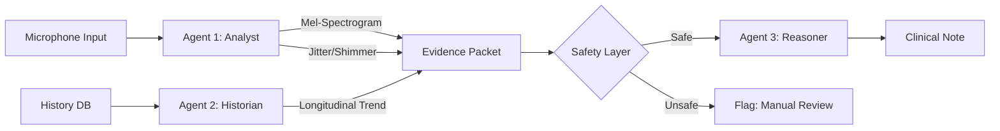

# MedGemma-PD: Clinical Reasoning over Speech Biomarkers
**(Multimodal • Agentic • Responsible AI)**

A **Clinical Decision Support System (CDSS)** that uses a Multi-Agent System to reason over **Mel-Spectrograms (Vision)** and **longitudinal speech biomarkers** for Parkinson's Disease tracking.

---

## 🌟 Strategic Pillars (Winning Features)

### 1. 👁️ Multimodal Analysis (Audio + Vision)
We don't just process numbers. The **Signal Analyst Agent** converts raw audio into **Mel-Spectrograms**, allowing MedGemma (via its SigLIP vision encoder capabilities) to "see" the vocal tremor pattern alongside traditional Jitter/Shimmer metrics.

### 2. 🤖 Agentic Workflow
The system is not a script; it is an orchestration of autonomous agents:
*   **Agent 1 (The Analyst)**: Multi-modal feature extraction (Vision + Numeric).
*   **Agent 2 (The Historian)**: Retrieves longitudinal patient context (UCI Telemonitoring data).
*   **Agent 3 (The Reasoner)**: Synthesizes evidence into a clinical narrative using MedGemma.

### 3. 🛡️ Responsible AI (Safety Layer)
We prioritize patient safety over blind predictions.
*   **The Safety Layer**: Intercepts predictions in the "Grey Zone" (40-60% confidence).
*   **Outcome**: If confidence is low, the system **BLOCKS** the AI output and flags it for manual review.

---

## 📂 Project Structure

```text
Gemma-Clinical-Speech-Biomarkers/
├── medgemma_pd/
│   ├── MedGemma_PD_Submission.ipynb  # <--- CORE KAGGLE SUBMISSION (Agentic Demo)
│   ├── audio_pipeline/               # Agent 1: Signal Analyst Logic
│   ├── reasoning/                    # Agent 3: MedGemma & Packet Builder
│   ├── models/                       # Weak Learners (Risk Estimators)
│   ├── ui/                           # Dashboard for Visualization
│   └── writeup.md                    # Detailed Hackathon Writeup
├── data/                             # PC-GITA & UCI Dataset Stubs
├── main.py                           # CLI Entry Point
└── requirements.txt                  # Python Dependencies
```

---

## 🚀 Quick Start

### Option A: Run the Kaggle Notebook (Recommended)
The core logic is demonstrated in `medgemma_pd/MedGemma_PD_Submission.ipynb`. 
This notebook is self-contained and demonstrates the **Spectrogram Generation** and **Safety Layer** in action.

### Option B: Run the CLI Mock Demo
```bash
# Install dependencies
pip install -r requirements.txt

# Run the pipeline for Patient P07 (High Risk Case)
python main.py --patient P07 --session 6
```
*Note: This runs the "Auto-Mock Mode" if heavy audio libraries (Librosa/Praat) are not configured.*

---

## 🔬 System Architecture



---
**Submission for MedGemma Impact Challenge**
